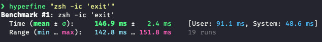

# ThachChau's setup guide

## Zsh shell configuration

- Using `antibody` plugin manager to generate static `zsh_plugins.sh` file and load it in `.zshrc`

  - ```
    brew install getantibody/tap/antibody
    antibody bundle < ~/.zsh_plugins.txt > ~/.zsh_plugins.sh
    # ~/.zshrc
    source ~/.zsh_plugins.sh
    ```

- Using `fzf`/`ripgrep` for fuzzy completion. 

- [Starship](https://starship.rs) prompt - `The minimal, blazing-fast, and infinitely customizable prompt for any shell!`

- [asdf](https://asdf-vm.com/) as Ruby/NodeJS version management

  - Why `asdf` but not `rvm`, `rbenv`?

    - `asdf` can manage not only Ruby but also NodeJS, PHP, elasticsearch and a lots of libraries.
    - Lightweight, do not pollute the `$PATH` as much as other tools.

  - ```bash
    brew install asdf
    ```

  - [asdf-ruby](https://github.com/asdf-vm/asdf-ruby) 

    - ```
      asdf plugin-add ruby https://github.com/asdf-vm/asdf-ruby.git
      ```

  - [asdf-nodejs](https://github.com/asdf-vm/asdf-nodejs)

    - ```
      asdf plugin-add nodejs https://github.com/asdf-vm/asdf-nodejs.git
      bash -c '${ASDF_DATA_DIR:=$HOME/.asdf}/plugins/nodejs/bin/import-release-team-keyring'
      ```

  - [asdf-direnv](https://github.com/asdf-community/asdf-direnv)

    - ```
      asdf plugin-add direnv
      ```

    - Explanation for my customized `.envrc`

      - Purpose of `asdf-direnv` - add current Ruby/NodeJS installation path to the current $PATH, so that the system can look up the correct Ruby/NodeJS excutables faster, instead of relying on `asdf`'s shim mechanism. However, this causes a slight delay since `asdf-direnv` has to calculate all the Ruby/NodeJS paths as specified in the `.tool-versions` file upon `cd` into a code folder.
      - I have customized `.envrc` file to generate an `.envrc.cache` file upon first `cd` in the folder containing the `.tools-version` and `.envrc`, which contains the full current `$PATH`. Next time, the plugin will just take the content of the `.envrc.cache` file and replace the `$PATH` variable, thus speed up the process drastically.
      - If you change the `.tool-version` file, just deleting the `.envrc.cache` file the `cd` out and in the folder again, the `.envrc.cache` file will be regenerated automatically.

- Fast shell initialization

  

# iTerm2 configuration

- [Snazzy](https://github.com/sindresorhus/iterm2-snazzy) colorscheme

# Dev environment configuration
- RubyMine - https://www.jetbrains.com/ruby/

  - Nice IDE if you have enough RAM.
  - Superior autocomplete and static code analysis support.

- TabNine - https://www.tabnine.com

  - AI-powered autocomplete

- IdeaVIM - https://github.com/JetBrains/ideavim

  - VIM on RubyMine

- Alfred with Powerpack

  - Clipboard manager is a nice to have productivity workflow

- AdGuard

  - Block ads at system level, using MacOS native Network Extension

- Typora

  - Lightweight and free Markdown editor.

- Karabiner Element

  - Map Capslock to Esc/Hyper key for a better VIM experience

    